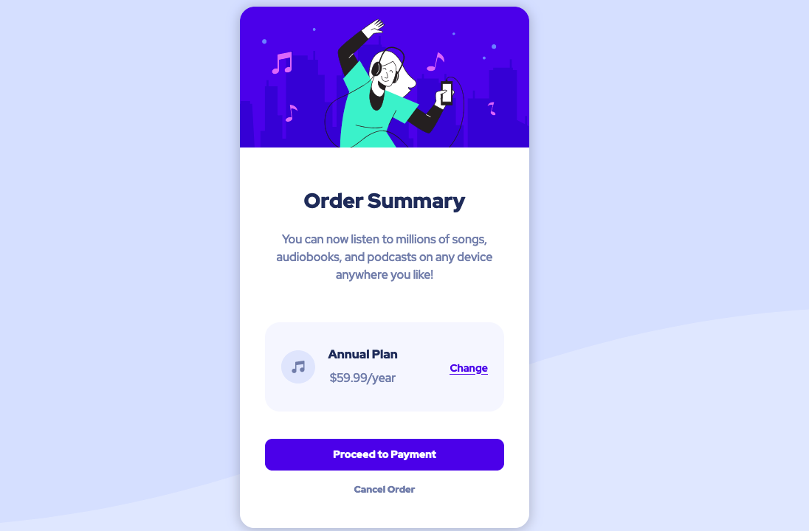

# Order summary card

## Table of contents

- [Overview](#overview)
  - [The challenge](#the-challenge)
  - [Screenshot](#screenshot)
  - [Links](#links)
- [My process](#my-process)
  - [Built with](#built-with)
  - [Useful resources](#useful-resources)
- [Author](#author)
- [Acknowledgments](#acknowledgments)

## Overview

Estimated time - 3 hours

### Screenshot

### Links

- Solution URL: [Order Summary Component [Bootstrap + BEM + Flexbox + SASS]](https://www.frontendmentor.io/solutions/summary-card-component-BJl9NhxV9)
- Live Site URL: [Order Summary Component](https://yashviradia.github.io/order-summary-component-main/)

## My Process

- For my detailed process check out my .

### Built with

- Semantic HTML
- Flexbox
- Bootstrap 5
- SASS

### Useful Resources

- 
- 
- 
- 

## Author

- 

## Acknowledgements

- 
